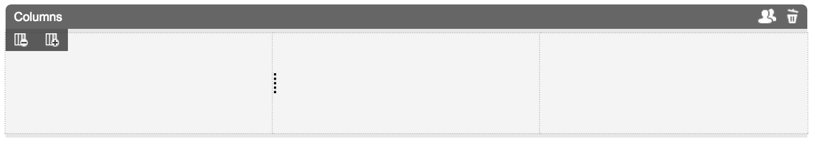

ColumnContainer
===============

Simple column container

## Information

| name                  | version           | bundle           |
| ----------------------|:-----------------:| ----------------:|
| container-column      | 1.0.2             | Universal        |

## Dependencies

* bd
* jQuery
* portalclient b$

## Product Description

Column container was built to bring grid functionality which is common to many CSS frameworks like Twitter Bootstrap.

## Functional Overview

Default grid system has 12 columns. Grid root element is Page Container, which has container class. Grid size is 940px or 12 columns, each span is 60px width with 20px margin. Columns have classes in `col-sm-X` format (where X is one of 1 to 12).

## Screenshots

CXP Manager screenshot

## Features
* Responsive

## Preferences

Container has 4 custom properties: columns (for storing column sizes) and gridSize, gutterWidth, spanWidth (for storing grid parameters mentioned above).

Preferences are hidden from preference panel. All management done using UI controls.

