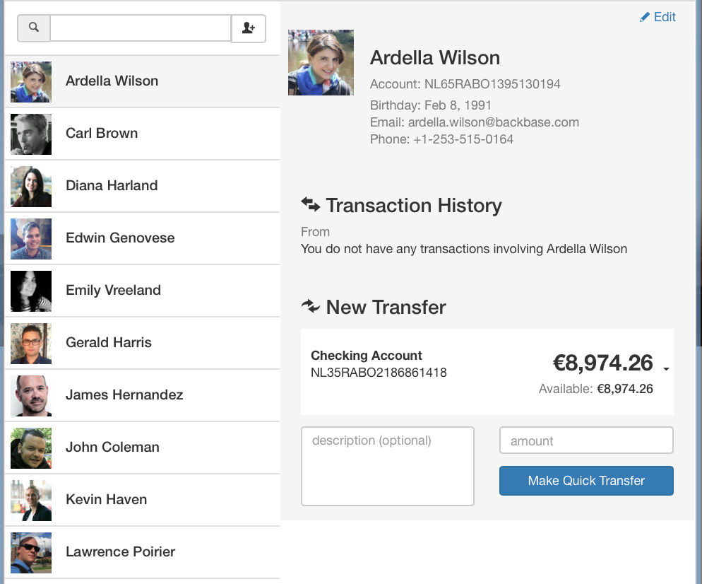

# Profile Contact
## Information
|  name |  version |  bundle |
|--|:--:|--:|
|  widget-profile-contact |  2.1.4 |  Universal |

## Brief Description
Provides an easy way for user to update his contact information. All the controls are created using the Editable Controls.

## Dependencies

- base ^2.9.0
- core ^2.12.4
- ui ^2.4.15
- module-users ^2.5.1

## Dev Dependencies

- config 2.x
- angular-mocks ~1.2.28

## Screenshots

## Preferences

- **saveUrl**: Places Data Source

*This widget does not have any preferences.*

##Events

*This widget does not subscribe/publish to any events.*

## Test
## Build
