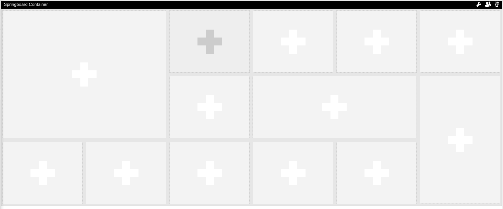
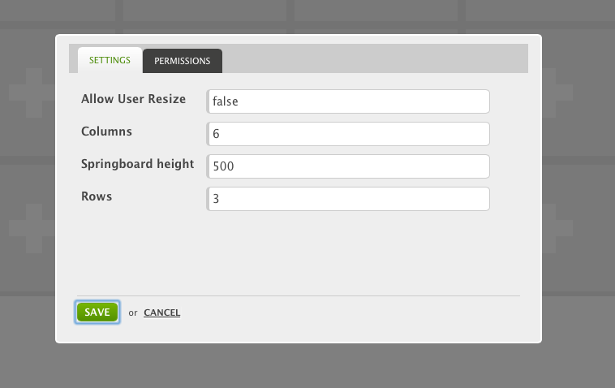

SpringboardContainer
====================

The Springboard container is intended for use at the next general dashboard widget container. It is heavily inspired by the Windows 8 tile UI, but differs in how the user manages the tiles.

## Features

| Feature                 | Description |
| :---------------------- | :---------- |
| Smart Tile resizing     | The tiles can be resized following a standard grid, with a neat alignment as result.|
| Minimized and Maximized | Widgets placed in the grid have a maximized view, overlapping the whole springboard, to allow for a full application to show.|
| Configurable Grid       | Managers can configure the grid for end users.|

## Product Description
Users can personalize their page by dragging, dropping, resizing and moving widgets around in their personal Springboard. It is even possible for end users to place the same widget with different views side by side. Note: To fill the springboard, it needs to be wired to a library widget. This needs to be done by a developer right now.

## Screenshots

